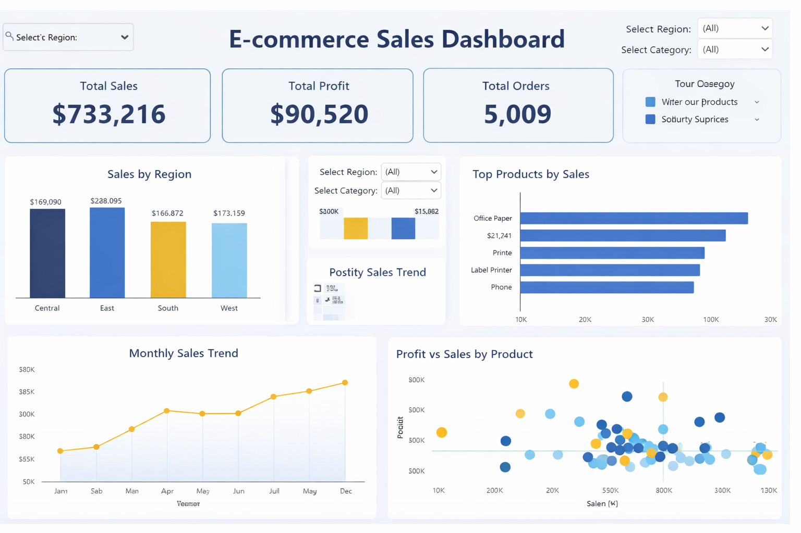

# 🛒 E-commerce Sales Analysis

## 📌 Project Overview
This project analyzes e-commerce sales data to identify trends, top-performing products, and regional performance. The goal is to derive actionable insights to improve business decision-making.

---

## 🛠 Tools & Technologies
- SQL (MySQL)
- Power BI
- Excel

---

## 📊 Key Analysis Performed
- Total Revenue Calculation
- Top 5 Selling Products
- Sales by Region
- Monthly Sales Trend

---

## 📈 Key Insights
- The **West region** generated the highest revenue among all regions.
- Certain products have **high sales but low profit**, indicating pricing or cost issues.
- Sales show a **peak during the end of the year**, suggesting seasonal demand.
- A small number of products contribute to a **major portion of revenue (Pareto effect)**.

---

## 📁 Project Structure
- `superstore_dataset.csv` → Raw dataset  
- `analysis.sql` → SQL queries for analysis  
- `dashboard.pbix` → Power BI dashboard (to be added)  

---

## ▶️ How to Run the Project
1. Import dataset into MySQL
2. Run queries from `analysis.sql`
3. Load dataset into Power BI
4. Create visualizations (charts & KPIs)

---

## 🎯 Business Impact
The insights from this project can help:
- Improve product strategy
- Optimize regional sales performance
- Increase profitability through data-driven decisions

---
## 📊 Dashboard Preview

## 👩‍💻 Author
Priyanshi Puniya
